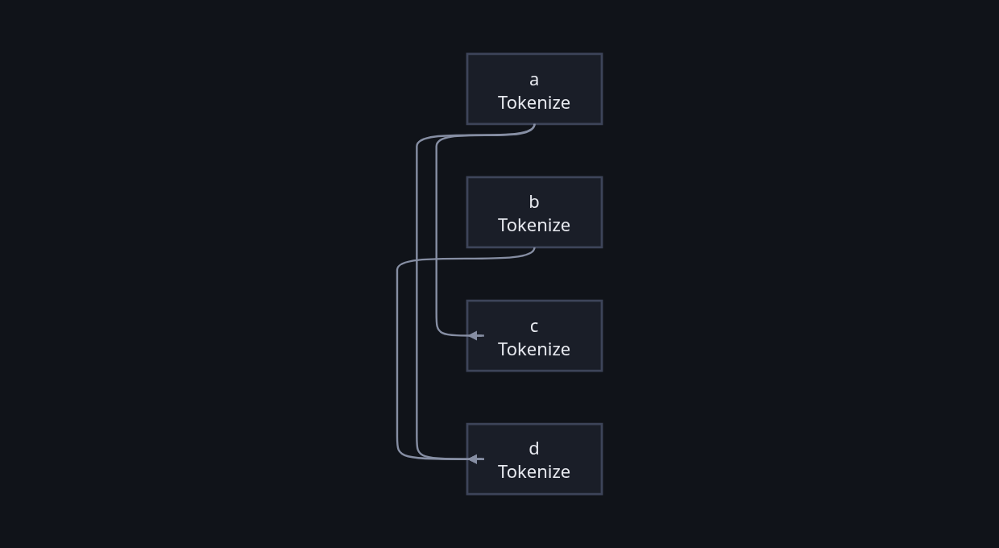

A `Graph` says which nodes exist. A `Plan` says **how they are walked**. Two
free functions in `soma-core` turn one into the other:

```python
spread.plan()        # the plan, compiled and distributed, as text
spread.plan_json()   # the same, as JSON — what the figure reads
spread                # in a notebook: the plan drawn
```

In Rust they are `compile(&graph, &catalog)` and then
`distribute(&plan, &placement)`.

There is no compiler object and no optimiser pass. The pages this replaces
described a compiler that validated types, planned distribution, detected
gradient flow, estimated cost and scheduled workers. `compile` does one thing:
it decides the shape.

## An enum, not a trait of executors

```rust
pub enum Plan {
    Empty,
    Execute { node: NodeId, from: Vec<NodeId> },
    Sequence(Vec<Plan>),
    Wave(Vec<Plan>),
    Remote { host: Host, inner: Box<Plan> },
}
```

Five variants, and no `#[non_exhaustive]`. The ways of executing are a closed
set, so the day a sixth arrives the engine's `match` stops compiling and
somebody has to decide what it means — instead of falling into a wildcard arm
and being quietly ignored. That is the taxonomy rule doing its job: an enum
when the set is closed and you know it.

Two of them carry the design:

**`Wave` is what runs at the same time**, one branch per connected component,
so the branches are disjoint by construction. Each branch is a whole plan, not
a step, which is what lets a branch run start to finish on one thread.

**`Remote` is a whole plan too**, not a step. That is the difference between
sending five messages and sending one: a chain of five nodes that all live on
the same host is one `Remote` and crosses the wire once.

## Every step says where its input comes from

`Execute` carries `from: Vec<NodeId>` — which nodes it reads, with empty
meaning the graph's own input. That one field is why **executing never looks at
the graph again**: a plan is self-contained, and a slice of it can be sent
somewhere that has never seen the graph.

It is also why fans in **both directions** need no variant of their own. A node
with three predecessors is an `Execute` with three entries in `from`, and it is
handed a map keyed by who sent what. A node with three successors is three
`Execute`s that each name it. Neither is a special case.

## It decomposes; it does not flatten

`compile` recovers the tree **from the graph** and never from the expression
that built it. This matters because the same graph built with `node()` and
`edge()` in a loop has to give the same plan as the one written with `>>` and
`|`. The DSL is a convenience, not a second source of truth.

| case | yields |
|---|---|
| no nodes | `Empty` |
| one node | `Execute` |
| the subgraph splits into components | `Wave`, one branch per component |
| there is a **series cut** | `Sequence` of the two sides |
| no cut | a flat `Sequence`: the graph is not series-parallel |

Which for `a >> (b | c) >> d`, with `c` placed on another host, is this — the
tree `g.plan()` actually prints:

```mermaid The plan for tokenize >> (strict | loose.at("w1")) >> vote. The numbers on a Sequence are order; a Wave's branches have none, because they run at once.
flowchart TD
    S["Sequence"]
    S -->|1| E1["Execute tokenize<br/>from: the graph's input"]
    S -->|2| W["Wave"]
    S -->|3| E4["Execute vote<br/>from: strict, loose"]
    W -->|at once| E2["Execute strict<br/>from: tokenize"]
    W -->|at once| R["Remote w1"]
    R --> E3["Execute loose<br/>from: tokenize"]

    classDef here fill:none,stroke-width:1px
    classDef away stroke-dasharray: 4 3
    class E1,E2,E4 here
    class R,E3 away
```

`Remote` sits **above** the node it carries rather than beside it, which is the
whole of what "a slice and not a step" means: everything under that box crosses
the wire once. And nothing in `Execute` refers to the graph — `from` is the
plan's own answer to *where does my input come from*, which is why a branch of
it can be sent to a process that has never seen the graph.

A **series cut** `(A, B)` is what a `>>` produces: the crossing edges run from
**all** the sinks of `A` to **all** the sources of `B`, and from nowhere else.
Only the prefixes of a topological order need testing, because in a serial
composition every node of `A` precedes every node of `B` in *any* topological
order.

## The last row is a theorem, not a gap

There are DAGs with no such tree. The minimal forbidden pattern is the **N** —
`a→c`, `a→d`, `b→d` — and the result is Valdes, Tarjan and Lawler, *The
recognition of series parallel digraphs*, SIAM J. Comput. 11(2), 1982.

The image of the DSL is **exactly** the series-parallel graphs, so the N is
only reachable through `node()`/`edge()`, and it falls to the flat `Sequence`.

That case is also what the drawing rules are built around. When the plan is a
flat sequence the nesting no longer says who feeds whom, so on a figure **the
boxes say *when* and the arrows say *what feeds what***. The N is the test that
keeps that honest:

```python
n = Graph()
for who in ("a", "b", "c", "d"):
    n.node(who, Tokenize())
n.edge("a", "c")
n.edge("a", "d")
n.edge("b", "d")
n.figure()
```



`a` and `b` share a box because they run at the same time, and the arrows —
not the box — say that `c` waits for `a` while `d` waits for both. There is no
nesting to read, and the figure does not invent any.

## Then it is cut a second time

```rust
pub fn distribute(plan: &Plan, placement: &Placement) -> Plan
```

`compile` never sees the `Placement`. `distribute` does, and it wraps
everything that runs elsewhere in `Remote`, grouping as much as it can and
descending only where a slice is spread across places. It is idempotent, and a
plan with no hosts comes out unchanged.

Two steps, and the reason is the asymmetry between the two halves of a
placement: **a device is inert for the traversal and a host is not.** Putting a
node on `cuda:0` changes nothing about who waits for whom; putting it on
`worker1` changes the shape of the walk. So the device never enters the plan,
and the host enters it in a pass of its own.

## The only way it can fail

```rust
pub enum CompileError {
    NoImplementation(NodeId),
}
```

One variant: the node is in the graph but nobody registered what it does. Cycles
cannot get this far — a `Graph` refuses the edge that would make one — and there
is no type checking to fail, because what crosses an edge is a closed set of
shapes rather than a schema somebody declared.

## What runs it

`Executor` walks the plan, and it is where the fifth fact arrives: before
attempting a node's work it derives that node's key and asks the `Keeper`
whether the answer is already kept. Since CU25 it does that for the **whole
plan first**, with nothing executed, and works backwards from the leaves — a
node whose answer is kept does not need its inputs, so a slice nobody needs is
never sent. `Fact::Spared` says so out loud, because a node missing from a
record cannot otherwise be told from one that was never in the graph.

See [what is remembered](/soma/running/what-is-remembered/) for the keys, and
[across machines](/soma/running/across-machines/) for what happens to a
`Remote`.
