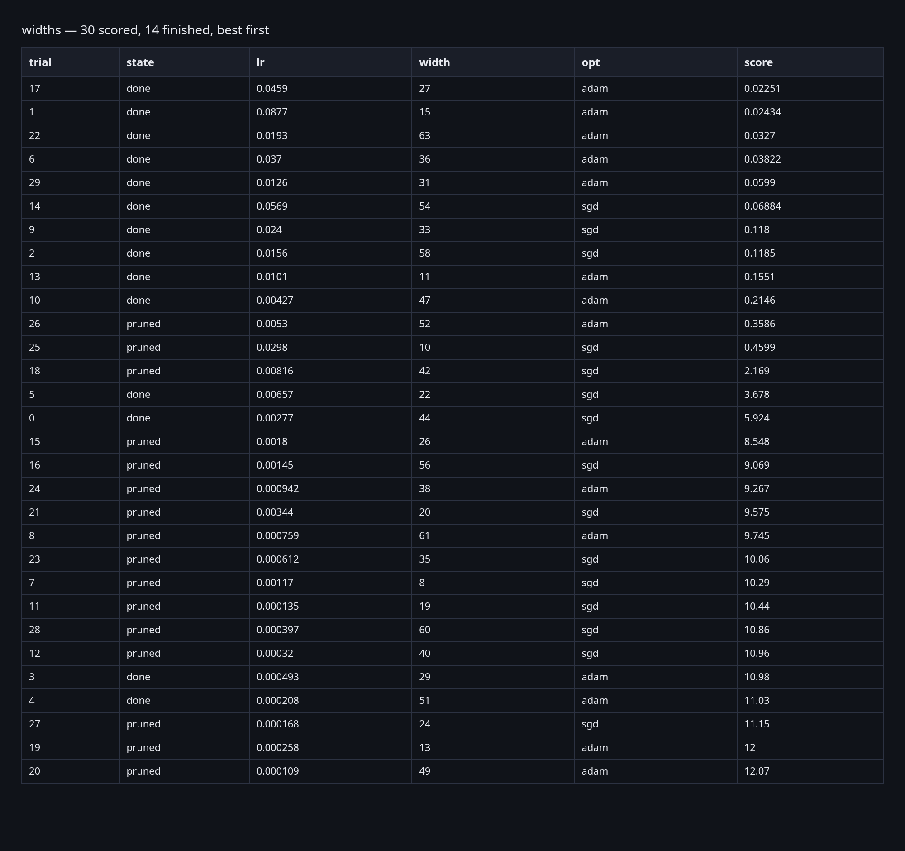
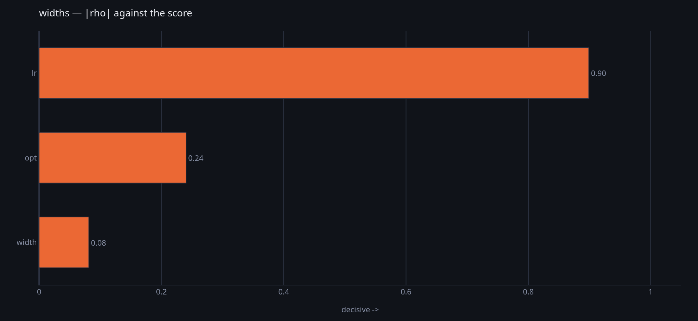
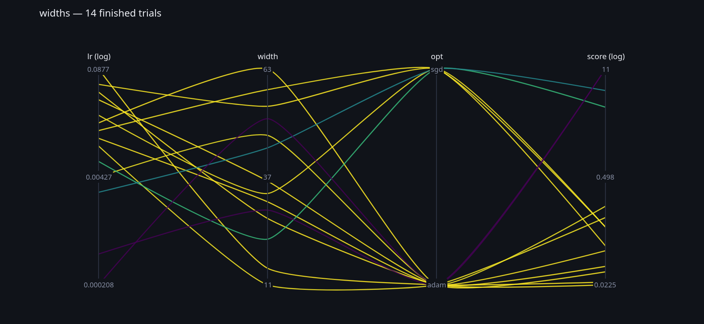

Searching hyper-parameters is the level above a training run, and here it has
**no type**: N runs are a `for` loop. What `somatize.study` provides are the
pieces that loop asks for — where to look, when to give up, and how two
machines share the work without talking to each other.

Everything below was run. The figures and the numbers are what it printed.

## The loop

```python
import os, socket, sys
import torch

import somatize.torch  # noqa: F401
from somatize import Graph, Node, Opaque, Store
from somatize.study import (DONE, PRUNED, Pruner, Sampler, Space, curves,
                            finished, in_flight, report, take)
from somatize.torch import Trainer, parameters

store = Store(sys.argv[1])
me = f"{socket.gethostname()}/{os.getpid()}"
STUDY, TRIALS = "widths", 30

space = (Space().real("lr", 1e-4, 1e-1, log=True)
                .int("width", 8, 64)
                .choice("opt", ["adam", "sgd"]))
sampler = Sampler.sobol(seed=0)
pruner = Pruner.median(goal="min", warmup=4, startup=6)

for trial in range(TRIALS):
    point = sampler.ask(space, trial, finished(store, space, study=STUDY)
                        + in_flight(store, space, study=STUDY))
    if not take(store, point, study=STUDY, trial=trial, me=me, goal="min"):
        continue                      # somebody else has that one

    # What the point says, built. A graph, and a Trainer over it.
    g = Graph.somatize(Body(point["width"]).named("body")
                       >> Head(point["width"]).named("head"))
    make = torch.optim.Adam if point["opt"] == "adam" else torch.optim.SGD
    t = Trainer(g, objective=torch.nn.functional.mse_loss,
                optimizer=make(parameters(g), lr=point["lr"]))

    said, why, so_far = [], None, curves(store, study=STUDY)
    for _ in range(8):
        said.append(sum(t.step(batch()) for _ in range(10)) / 10)
        # A pruner stops nothing: it answers, and the loop stops calling.
        if why := pruner.verdict(said, so_far):
            break

    report(store, point, said, study=STUDY, trial=trial, me=me,
           state=PRUNED if why else DONE, because=why, score=said[-1], goal="min")
```

`Body` and `Head` are ordinary nodes and `batch()` is yours — the
[quickstart](/soma/start/quickstart/) has both. Everything a training run
needs is [`Trainer`](/soma/running/training/): the study layer adds no way to
train and asks the trainer for nothing. That is what `verdict` returning an
answer buys — **a pruner stops nothing**, the loop stops calling it, and no
method had to be added one level down.

## What it found

Thirty trials, seventeen of them pruned before their eighth epoch:



The state column is why `table` exists rather than a `print`: **pruned and
finished are never ranked together**, because a pruned trial's score was
measured after fewer epochs and is not comparable with one that ran to the end.
The rows are there; the ranking is not pretending they are the same thing.



`influence` is Spearman's ρ against the score, and it says the learning rate
decided almost everything — 0.90 against 0.30 for the optimizer and 0.13 for
the width. Which is the answer you would want before spending a night on
widths.



`coordinates` is the one that shows *where the good ones live* rather than
which knob mattered: each trial is one curve across the axes, so a band of
good scores gathering at one end of `lr` is visible as a shape. It is
hand-drawn out of splines because plotly's `Parcoords` only draws straight
segments, and it trades brushing for a trial reading as a single curve.

## The second machine is the same file

Run it twice against one directory:

```console
$ python search.py /scratch/study &   python search.py /scratch/study &   wait

yilliqiya/1434780: 15 of 30 trials were mine
yilliqiya/1434781: 15 of 30 trials were mine
```

Fifteen and fifteen. **Every trial claimed exactly once**, and nothing
coordinated it — no server, no port, no lock daemon, nothing to keep alive.

It works because a trial is a **number** and `ask` is a function of that
number: a machine that claims trial 7 derives the same point everybody else
would have, without replaying six. So the only thing left to settle is *who has
7*, and `take` settles it with one conditional write. **The state is the
queue.**

Which is why the two runs explore the *same thirty points*. Read the second
study back and the same two configurations come out on top as in the first,
their order swapped, and `influence` still says `lr` — 0.89 against 0.30 and
0.13. What differs is who ran which, and the scores by a hair, because each
process seeds its own batches.

The share need not come out even; nobody was assigned anything, and the machine
that got free first took the next number. Slurm distributes, and a shared folder
is all the machines have in common.

`in_flight` is what stops the two proposing neighbours: `ask` takes a score
that **may be absent**, and absent means *running*. Those points are avoided
without voting on how big the good pile is — handing a guided sampler a made-up
bad score for a running trial moves the threshold the wrong way, which was
[measured](/soma/searching/handing-out-trials/).

## Two nodes with the same knob

The question the shape above does not answer: `Body` and `Head` both take a
`width`, and here they are handed the **same** one. That is a decision, not a
default — and it is worth knowing exactly what the library does and does not do
for you.

**A `Space` is one flat namespace of knobs, and the wiring is yours.** There is
no per-node scoping, because `Space` never learns that a graph exists: it
searches configurations, and turning one into a graph is the `build` step you
write. So two nodes share a knob when you pass the same one to both, and get
their own when you declare two:

```python
space = (Space().real("encoder.lr", 1e-5, 1e-1, log=True)
                .real("head.lr",    1e-5, 1e-1, log=True)
                .int("encoder.width", 16, 256)
                .int("head.width",    16, 256))

point["encoder.lr"]      # 8.388688315128687e-05
str(point)               # encoder.lr=0.00008388688315128687,head.lr=0.000336…
space.read(str(point))   # the same point back
```

A dot is just a character — the name is yours, and prefixing it with the node
it belongs to is a convention worth keeping, not a feature. It survives
`str(point)` and comes back through `space.read`, which matters because that
text **is** how a trial's configuration is kept beside its score: one scan of
the folder, no fetches.

One thing a dotted name costs: `Body(**point)` cannot work, because
`encoder.lr` is not a Python identifier. Read them by name instead — which is
what the loop above does anyway, since the point has to be split between two
constructors regardless:

```python
g = Graph.somatize(
    Body(point["encoder.width"]).named("body")
    >> Head(point["head.width"]).named("head"))
```

And the trade is real in both directions. Two knobs where one would do doubles
the volume of the space and the sampler has to fill it; one knob where two are
needed can never find the answer where the two differ. The loop above shares
`width` on purpose, because the body's output *is* the head's input and two
numbers there would be one number and a constraint.

## The pictures are library functions

```python
from somatize.study import coordinates, influence, table
```

They return plotly figures, so a notebook shows them and a script saves them
with `.write_image(...)`. They are read out of a **store**, not out of the loop
that filled it — so the machine that draws them is not the machine that ran
anything, and a study that is still going draws just as well as a finished one.

## Where to go next

[A study](/soma/searching/a-study/) is the design underneath: the three
families, why `ask` is a function of the index, and where the line between Rust
and Python falls. [Handing trials out of a folder](/soma/searching/handing-out-trials/)
is the distributed half — `claim` against a directory and against an S3 bucket,
what a folder can and cannot tell you, and the measurement behind `in_flight`.
[Notebook 04](/soma/tutorials/04-a-study/) runs all of it in a live kernel, and
the full surface is [`somatize.study`](/soma/reference/python/study/).
