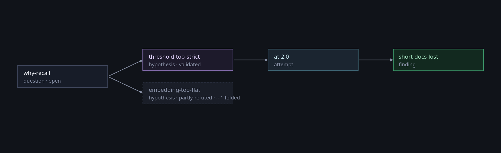

A repository keeps what the code became. It does not keep **what you were
trying to find out** — which question you were on, what you supposed, what the
run said, and why the line was dropped. That lives in a notebook nobody else
reads, and it is the half that is gone in six months.

`somatize-tree` writes both down beside the code. One rule decides which is
which:

> **If it can be recalculated it is record. If somebody thought it, it is
> reasoning.**

So *the strict classifier's key moved between these two commits* is never
stored — it is derived, on demand, from the commits themselves. And *we think
the threshold is throwing away the short documents* is stored, because nothing
can work it out.

```bash
cargo install somatize-tree      # a binary; the wheel has no use for one
```

## The fastest way to see it

There is a walkthrough in the repository that builds a small investigation from
nothing — four commits, each a real kind of edit, one of them wrong on purpose
— and reads it back at each step:

```bash
soma-tree/tests/an-investigation.sh
```

It takes about a minute. It is also the fixture the end-to-end tests run
against, so it cannot rot without the suite going red. Every `diff` and `log`
below is its output, headers trimmed, except the one section that says it comes
from somewhere else; the reasoning half is a session run in the same repository,
since the script only builds the record.

## What it needs

A file at the root saying how to build the graph, so `somatize-tree` can ask a
commit what its nodes would be called without checking anything out by hand:

```toml
build  = "experiments.encoder:build"
python = "/path/to/python"          # one that can import somatize
tree   = "an-investigation"         # so several investigations share one store
```

## The record: what an edit did

`diff` compares two commits node by node. It runs nothing — every name comes
from the recipe, which is what makes the question cheap enough to ask about ten
commits at once.

A knob through a constructor moves the key, so the cache misses:

```console
$ somatize-tree diff HEAD~3 HEAD~2

  strict  CHANGED  (Classify(threshold=1.0) → Classify(threshold=2.0))
  vote    DOWNSTREAM

The edit is in: strict
No node will be handed a cached value that is no longer its own.
2 node(s) with results NOT comparable with the ones before.
```

Editing the **body of a `forward`** does not. That is deliberate — a cosmetic
refactor must not invalidate half the store — and it is exactly the case
nothing else catches:

```console
$ somatize-tree diff HEAD~2 HEAD~1

  embed   STALE
  loose   SUSPECT
  strict  SUSPECT
  vote    SUSPECT

The edit is in: embed
⚠ 1 node(s) with the SAME key and other code: the cache will HIT.
4 node(s) with results NOT comparable with the ones before.
```

`STALE` says *you should have bumped the salt*; `SUSPECT` is everything under
it, which goes on being fed the old code's answer whatever became of its own
name. And retraining is not an edit at all — `RESETTLED` is another checkpoint,
not another variant.

`log` walks a whole line at once, and folds the ones somebody abandoned:

```console
$ somatize-tree log HEAD~3..HEAD

experiments.encoder:build   ·   3 commits

39eecf3e3b38  encoder retrained, same code  [under something invalid]
     │    no edit · resettled: embed
8c5d987a63bf  the embedding becomes quadratic  [invalid]
     │    edit: embed · ⚠ STALE: embed · ⚠ suspect: loose, strict, vote
5079a3dd676a  the strict threshold goes up to 2.0
     │    from b03661be7c68 · edit: strict

2 of the steps leave results NOT comparable with the one before.
```

Nobody marked the top commit. It inherits the doubt through git, because
`verdict invalid` is the one judgement whose consequence is mechanical:
everything under it becomes suspect, and nobody had to write that down.

### And in a repository nobody wrote for this

Everything above is the walkthrough, and a walkthrough plants what it wants you
to find. The one thing it cannot show is the case this command exists for:
somebody who was not looking.

`symptoms-or-shortcuts` is a real study — the interpretable end of a paper,
four nodes in a line, distilled onto current `somatize`. Nine commits of
ordinary work: a device name, a plotting import, a batching bug. Asked what
those commits did, with nothing running and nothing checked out:

```console
$ somatize-tree log --most 8

probing 9 of 9 commits; 0 were already known
csb.graph:build   ·   8 commits

0483214b4547  A channel hands the readout a rate, not a sum, and it is the axis that mattered
     │    edit: channels
2b5012bff14a  Ask the evidence whether it separates the classes, before blaming a cell
     │    no changes
b04c93e54f5a  The first full run flagged everybody, and two things were wrong
     │    no changes
8e63947d2a5f  A batch is a cache key, so who is in one cannot depend on the seed
     │    no changes
83d597c43dd2  A missing plotting library must not throw away a finished run
     │    no changes
b9d1d33a5d0b  The device is cuda:0 and never cuda: somatize refuses the bare name
     │    no changes
6132a2f397e5  Evaluate on the batching that was trained on, or the cache never hits
     │    no changes
9420fafb9a61  Training, evaluation and the queue: a run of the interpretable end, end to end
     │    from 9268e85172de · edit: channels, encoder, evidence, readout · ⚠ STALE: channels, encoder, evidence, readout · ⚠ suspect: channels, evidence, readout

2 of the steps leave results NOT comparable with the one before.
```

Six of the eight steps moved nothing, which is the answer you want from six
commits about a device string and a missing import. The one that did:

```console
$ somatize-tree diff 9268e85 9420faf

  channels  STALE · SUSPECT
  encoder   STALE
  evidence  STALE · SUSPECT
  readout   STALE · SUSPECT

The edit is in: channels, encoder, evidence, readout
⚠ 4 node(s) with the SAME key and other code: the cache will HIT.
4 node(s) with results NOT comparable with the ones before.
```

**Every node in the graph, with the same key and other code.** The commit that
first wired the thing up end to end rewrote all four `forward` bodies and moved
not one name, because [the fingerprint is deliberately not in the
key](/soma/running/what-is-remembered/) — so a store filled before it would have
gone on answering, correctly as far as anything could tell, with the previous
model's activations.

Nobody wrote that commit as a lesson and nobody went looking. It is the whole
argument for asking by default: a planted `STALE` proves the detector fires, and
only an unplanted one says the question was worth asking.

The repository is not published — it is somebody's research, and the numbers in
it are theirs. What is reproduced here is the two commands and what they
printed.

`diff` follows `git diff --quiet`: **0** means nothing moved, **1** means
something did, and **2** is an error. So a hook can branch on a stale key
without parsing a word of the output.

`note` and `show` are the loose ends — prose about a commit, and everything
anybody said about one.

## The reasoning: what you were trying to find out

Five kinds and there are no more: `ask`, `suppose`, `tried`, `found`, `decide`.
They are commands rather than a library because they happen **between** runs,
one at a time, while somebody thinks.

```bash
somatize-tree ask why-recall \
  -m "Recall sits at 0.61 and nothing we change moves it. What is holding it down?"

somatize-tree suppose threshold-too-strict --under why-recall \
  -m "The strict classifier at 2.0 throws away the short documents."
somatize-tree suppose embedding-too-flat --under why-recall \
  -m "A linear embedding cannot separate them at all, whatever the threshold."
```

An attempt is the only kind that touches the record, and it says **which
commit** it ran — being on that checkout is not the same thing as citing it:

```bash
RAN=$(echo 'python -m experiments.run --threshold 2.0 --seed 7' | somatize-tree keep)

somatize-tree tried at-2.0 --under threshold-too-strict --cites 5079a3d --ran "$RAN" \
  -m "Ran the strict classifier at 2.0 on the full split."
somatize-tree found short-docs-lost --under at-2.0 \
  -m "Recall on documents under 20 tokens is 0.31; on the rest it is 0.79."
```

A commit is only half of what ran: the same one under two configurations is two
experiments, and git has no word for that. `keep` is the other half — the
resolved invocation, kept by its content, so writing the same one down twice is
one thing kept and two attempts citing it.

Then say what the evidence does to what you supposed, and decide:

```bash
somatize-tree says short-docs-lost validates threshold-too-strict --about at-2.0
somatize-tree says short-docs-lost refutes embedding-too-flat --partly
somatize-tree decide abandon drop-flat-embedding --about embedding-too-flat \
  -m "The split by length explains it; the embedding is not the problem."
```

`moves` reads it back, and the standing on each line is **derived and never
stored** — it is what the edges say, recomputed:

```console
$ somatize-tree moves

why-recall · question · open · Recall sits at 0.61 and nothing we change moves it. What is hold…
  threshold-too-strict · hypothesis · validated · The strict classifier at 2.0 throws away the short documents.
    at-2.0 · attempt · Ran the strict classifier at 2.0 on the full split.
      short-docs-lost · finding · Recall on documents under 20 tokens is 0.31; on the rest it is 0…
  embedding-too-flat · hypothesis · partly-refuted · A linear embedding cannot separate them at all, whatever the thr…
    ⋯ 1 folded · abandon · The split by length explains it; the embedding is not the proble…
```

And it draws, from the same store and with nothing run again:



Hue says which of the five kinds a move is and **never whether it went well** —
how a question stands is written on it, in words. The abandoned line is the
dashed box, folded, saying how many it hides.

Nobody typed `validated` or `partly-refuted`. Which matters when a commit a
refutation rested on is later judged `invalid`: the hypothesis goes back to what
it was before, with nobody saying anything again.

The abandoned line folds, **saying how many it hides and why** — `--all-lines`
opens it. A dead end that vanishes is a dead end somebody walks into twice.

`--about` is what makes the best outcome an investigation gives sayable at all.
Two edges of opposite sign whose scopes **touch** are a dispute; the same two
where they do not touch is `depends` — validated in some situations and refuted
in others, which is neither half an answer nor a conflict.

## Getting back to it

The point of having written any of this down:

```console
$ somatize-tree go at-2.0

at-2.0 · at 5079a3dd676a · Ran the strict classifier at 2.0 on the full split.

  ran with:
    python -m experiments.run --threshold 2.0 --seed 7
```

It leaves you on a branch named after the move. Git asks for a hash; what
anybody remembers is the idea. And arriving at a commit that has already been
measured is arriving to make the **next** variant, never to rewrite that one —
which is why it is a branch and not a checkout.

`here` is the same question the other way up: what the commit you are on was
for.

## The eighteen

| | |
|---|---|
| `diff` `log` | what an edit did, for two commits or a whole line |
| `note` `verdict` `show` | prose about a commit, marking one invalid, and reading it all back |
| `ask` `suppose` `tried` `found` `decide` | the five kinds, written one at a time |
| `hang` `says` | what a move hangs under, and what it says to another |
| `go` `here` `keep` | back to a move, what this commit was for, and the invocation that ran |
| `moves` | the reasoning as it stands |
| `trials` `data` | what was run with one version, and what the store holds under each |

`trials` and `data` are the two that read what a run left behind. Trials are
written from Python, by whoever runs the study, and only read here — the version
is the commit and does not change, while the trials grow without end. `data`
attributes the intermediates in a store to the version that made them, and
**deletes nothing**: what is spare is a decision, and decisions get written
down, not inferred.

Drawing it, folding it and reading it from Python is
[`somatize.reasoning`](/soma/reference/python/reasoning/) — the terminal is for
what happens between runs, the library for looking at it. Notebook 13 does that
end to end.
