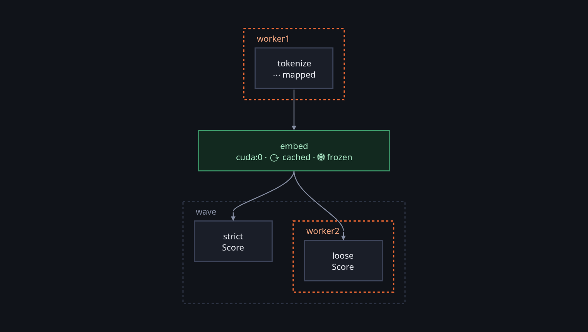
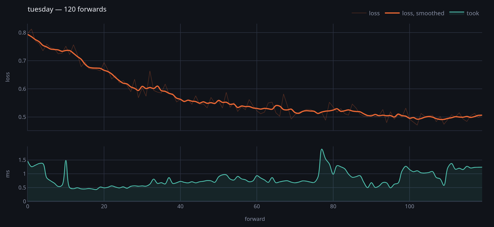
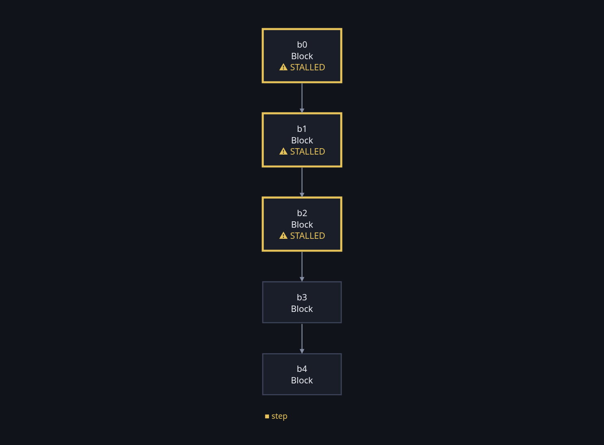

`somatize` is a computational graph. You declare it in Python — or in Rust,
with the same operators — and it is compiled and executed in Rust:

```python
Graph.somatize(tokenize >> (strict | loose) >> vote)
```

A node is **one thing**: `forward(input, ctx)` takes what arrived along the
edges and returns what it produced. There is no filter type and no step type,
and nothing in a return value tells them apart. Whatever a node needs in order
to answer — a retry, a model, three rounds of something — happens inside it.

Everything else is a **suffix on the declaration**, and none of it changes a
`forward`:

```python
tokenize.at("worker1")      # which machine
embed.on("cuda:0")          # which device
embed.cached()              # worth keeping
embed.frozen()              # settled, so what is kept stays valid
source.mapped()             # one name per item, not per batch
```

Which is a picture, and it draws itself:



Nothing has run there. The dashed frames are the two machines, the green box is
the device, `cached · frozen` is what is remembered, and `wave` is the plan's
word for what happens at the same time — one figure carrying every suffix
above it.

## The five facts, which are the thing to hold

Confusing them is the easy mistake, and the whole design is arranged so the
compiler keeps them apart:

| | says |
|---|---|
| `Graph` | **what** exists |
| `Catalog` | **who** executes it |
| `Placement` | **where** |
| `Plan` | **when** |
| `Memory` | **what is remembered** of each node |

The device deliberately does not live in the plan. See
[the model](/soma/model/overview/).

## And it can be asked what it did

That is a third of what is here, and it is split in three on purpose, because
the original kept all three in one enum of thirty-seven variants:

- **The declaration, drawn.** A graph draws itself having never run — the boxes
  say *when* and the arrows say *what feeds what*.
- **The record of what happened.** A run emits facts as it goes, through a hole
  in the core called `Watcher`, so a notebook is told live and a store is
  written for later. What happens on another machine comes back down the
  connection that was already open.
- **The diagnosis, which says it is an opinion.** Dead units, saturation, a
  step-to-weight ratio that has gone. It is computed from the stored record and
  never from a second training run, which is what makes arguing about a
  threshold cost a scan rather than an afternoon of GPU.

Those three, in order — a run read back out of the store, and a diagnosis drawn
on the graph the ill layers are in:





The second one is the point of keeping them apart: that verdict came out of the
stored record and not out of a second training run, so moving a bound and asking
again costs a scan.

Around those: `probe`, which is one recorded forward that never trained, so
something can be said before the first step is taken; `fleet`, which turns the
record the other way up and asks what each machine was doing; `foreseen`, which
says what an edit invalidated before anybody pays to find out; and
`somatize-tree`, which writes down what you were **trying to find out** —
questions, hypotheses, attempts, findings and decisions, in a DAG beside the
code.

## Why it was written by hand

There is an earlier `soma`. It works, it is published, and it stopped being
maintainable by the person who wrote it: fourteen traits with a single
implementor, two with none, and a type count somewhere past three hundred.
Nothing was wrong with the code. What was wrong is that its author could no
longer hold it in his head.

So this is a **re-derivation**, written one use case at a time, and the goal is
not a better design — it is **authorship**. A system you designed yourself you
can hold in your head even with three hundred types in it; one you did not, you
cannot.

Three rules came out of that, and they are the reason this documentation is
shaped the way it is:

**Nothing is written without a real consumer today.** No crate is built before
something uses it. A trait is only a trait when the implementation is supplied
by somebody else, and if two real implementors cannot be named, it is a struct.

**A hole with no tenant is deleted.** The core provides five and fills none of
them — `Node`, `Transport`, `Keeper`, `Watcher`, `Codec`. There was a sixth,
`Driver`, and after eighteen use cases it had no consumer outside its own
tests. It went. `Watcher` arrived with two implementors in two crates on the
first day, which is the bar.

**The old test suite is a questionnaire, not a template.** Its thirty-two
thousand lines of tests are the executable specification of what has to be
true; they are read for the guarantees and answered with whatever call shape is
decided here. Copying them would have recreated the API this exists to replace.

Every decision is written down at the moment it was taken, in
[the use cases](/soma/use-cases/) — thirty-eight of them, and they are the
document the project is written from.

## What it is not

- **Not a workflow scheduler.** There is no server, no coordinator and no
  registry. A worker serves slices to whoever is talking to it; a machine
  claiming trials from a folder is watched by *is it still writing*. Slurm, or
  whatever you already have, distributes.
- **Not an experiment tracker you point at your code.** The record is
  something the engine emits, not something scraped afterwards, which is why a
  live view and a written report cannot drift apart: they are one drawing
  function fed by the same dict.
- **Not an agent framework.** An earlier version of this document promised
  one. A node is a function; if it calls a model, that happens inside it.
- **Not asynchronous.** There is no runtime in the core and no `tokio` in the
  data layer. `Store` is synchronous on purpose, and that is the reason SQL is
  not in it — every driver worth using drags a runtime along.

## Where to start

[Install and write a first graph](/soma/start/quickstart/), or open
[the notebooks](/soma/start/notebooks/): thirteen of them, shipped executed
with their outputs, so reading one shows what it does.
